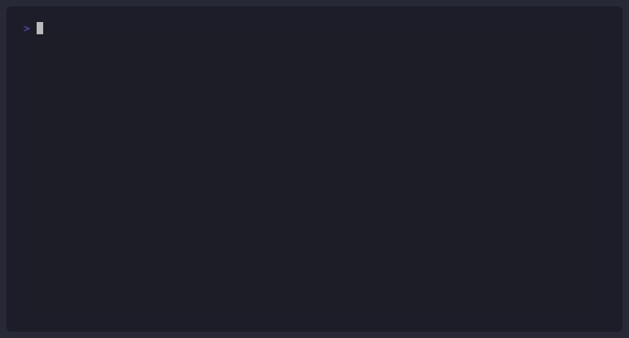

# CloudPorter

Every cloud provider has its own way of doing things. Learning to deploy on AWS doesn't prepare you for Azure, the services, the APIs, and the configuration formats are completely different. Switching clouds means starting over.

CloudPorter gives you a single format to describe your infrastructure, compares what it would cost on each provider, and deploys it wherever you choose.

One manifest. Any cloud.



## Install

```bash
uv tool install cloudporter
```

Installs `cloudporter` as a system command. Requires [uv](https://docs.astral.sh/uv/getting-started/installation/). Alternatively with pip:

```bash
pip install cloudporter
```

## Dependencies

Most CloudPorter commands work out of the box. A few have external requirements depending on what you're doing:

- **[OpenTofu](https://opentofu.org/docs/intro/install)**, needed for `translate` and `deploy`. CloudPorter generates OpenTofu templates and applies them under the hood.
- **[AWS CLI](https://docs.aws.amazon.com/cli/latest/userguide/install-cliv2.html)** configured with `aws configure`, needed to deploy to AWS.
- **[Azure CLI](https://learn.microsoft.com/en-us/cli/azure/install-azure-cli)** authenticated with `az login`, needed to deploy to Azure.

`validate`, `audit`, and `estimate` require none of the above.

## How to use CloudPorter

Write a manifest. Run `estimate` to see what it costs on each cloud. Deploy with a single command. Switch providers by changing one flag. That's the workflow.

### The manifest

Everything starts from a **manifest**, a YAML file with a `name` and a list of `resources`. Each resource has a `type` that determines what fields are available.

**`type: compute`** is a virtual machine.

| Field | Required | Description |
|---|---|---|
| `cpu` | yes | Minimum vCPUs (CloudPorter picks the closest instance type) |
| `memory_gb` | yes | Minimum RAM in GB |
| `os` | yes | `ubuntu-22.04`, `ubuntu-24.04`, or `windows-server-2022` |
| `public` | no | `true` assigns a public IP and opens port 80. Default: `false` |
| `run` | no | Shell script that runs once on first boot. Supports `{{ name.private_ip }}` (compute IP), `{{ name.host }}` (database host), and `{{ var.name }}` (input variable) references. |

**`type: database`** is a managed relational database.

| Field | Required | Description |
|---|---|---|
| `engine` | yes | `mysql` or `postgres` |
| `cpu` | yes | Minimum vCPUs |
| `memory_gb` | yes | Minimum RAM in GB |
| `storage_gb` | yes | Storage in GB. Minimum: 20 |

The following manifest uses every field currently supported, a public frontend, a private backend, and a MySQL database:

```yaml
name: inventory-app
resources:

  # A compute resource is a virtual machine.
  - name: frontend
    type: compute
    cpu: 2              # minimum vCPUs, CloudPorter picks the closest instance type
    memory_gb: 4        # minimum RAM
    os: ubuntu-22.04    # ubuntu-22.04, ubuntu-24.04 or windows-server-2022
    public: true        # assigns a public IP and opens port 80
    run: |              # shell script, runs once on first boot
      apt-get install -y nginx git
      git clone https://github.com/myuser/myapp /app
      # reference other resources with {{ name.attribute }}
      # CloudPorter resolves this to the real IP or hostname at deploy time
      echo "proxy_pass http://{{ backend.private_ip }}:3000;" > /etc/nginx/proxy.conf
      systemctl restart nginx

  - name: backend
    type: compute
    cpu: 2
    memory_gb: 4
    os: ubuntu-22.04    # no public: true, private VM, no public IP assigned
    run: |
      apt-get install -y nodejs
      export DB_HOST="{{ app-db.host }}"   # resolves to the DB endpoint at deploy time
      node server.js

  # A database resource is a managed relational database.
  - name: app-db
    type: database
    engine: mysql       # mysql or postgres
    cpu: 2
    memory_gb: 4
    storage_gb: 20      # minimum: 20 GB
```

### Commands

CloudPorter currently exposes five commands that take you from manifest to running infrastructure:

```bash
cloudporter validate manifest.yaml                   # check the manifest is valid
cloudporter audit    manifest.yaml                   # catch architectural issues early
cloudporter estimate manifest.yaml                   # compare monthly costs across providers
cloudporter translate manifest.yaml --provider aws   # generate OpenTofu templates
cloudporter deploy   manifest.yaml --provider aws    # deploy
```

`estimate` is worth running before anything else, it fetches live pricing and shows what your architecture would cost per month on each supported provider, so you can pick based on actual numbers.

When you're ready, `deploy` translates the manifest and applies it. To deploy to Azure instead of AWS, change `--provider aws` to `--provider azure`. The manifest stays exactly the same.

### Examples

The [`examples/`](examples/) directory has ready-to-use manifests to get started, single-resource examples for each supported feature, and [`examples/inventory-app/`](examples/inventory-app/) which is the full 3-tier app above, deployable on both AWS and Azure from the same manifest.
